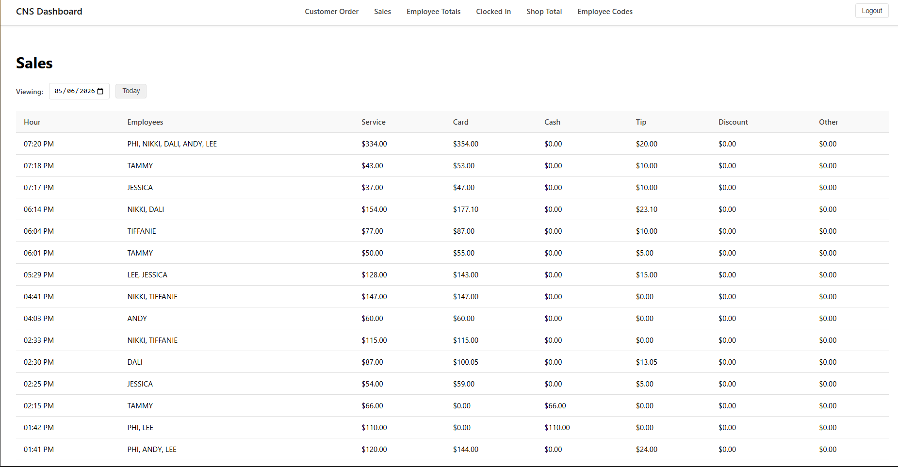
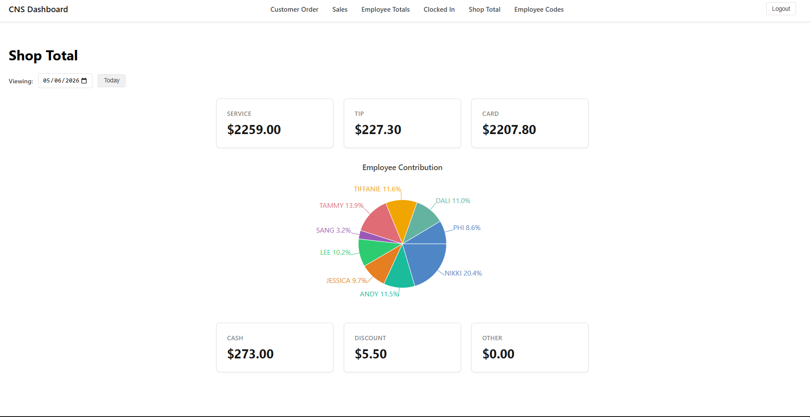
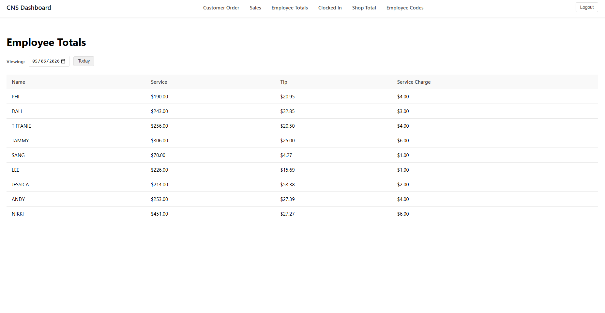

# CNS Dashboard

A full-stack salon/spa management dashboard built with **React** and **Flask**. Track sales, employee performance, customer orders, and shop totals in real time.

## Screenshots

| Sales View | Shop Total | Employee Totals |
|---|---|---|
|  |  |  |

## Features

- **Sales Breakdown** — View daily sales split by card, cash, service, tips, discounts, and other
- **Shop Total** — Aggregated daily revenue with visual charts
- **Employee Totals** — Per-employee breakdown of price, tips, and service charges
- **Clocked-In** — See which employees are currently working
- **Customer Orders** — Manage orders with notes and done/undo toggling
- **Employee Codes** — Look up employee passcodes
- **Authentication** — Session-based login for authorized staff

## Tech Stack

| Layer      | Technology                                |
|------------|-------------------------------------------|
| Frontend   | **React 19**, Recharts, react-router-dom  |
| Backend    | **Python 3 / Flask 3**, Flask-Login, SQLite |
| Infra      | **Docker** / Docker Compose               |

## Quick Start

### Docker (recommended)

```bash
docker-compose up
```

- Frontend: http://localhost:3000
- Backend API: http://localhost:5000

### Manual

**Backend**

```bash
cd backend
pip install -r requirements.txt
flask run
```

**Frontend**

```bash
cd frontend
npm install
npm start
```

## Configuration

Set environment variables in `backend/.env`:

```
SECRET_KEY=your-secret-key
AUTHORIZED_USERS=[{"username":"admin","password_hash":"..."}]
```

Point the frontend to the API in `frontend/.env`:

```
REACT_APP_API_URL=http://localhost:5000
```

## Scripts

| Command           | Description                        |
|-------------------|------------------------------------|
| `npm start`       | Start React dev server             |
| `npm run build`   | Production build                   |
| `npm test`        | Run frontend tests                 |
| `flask run`       | Start Flask dev server             |

## Project Structure

```
cns_dash/
├── backend/
│   ├── app.py              # Flask entry point
│   ├── database.py         # SQLite connection
│   ├── routes/             # API blueprints
│   │   ├── sales.py
│   │   ├── employee.py
│   │   ├── customer.py
│   │   └── login.py
│   └── requirements.txt
├── frontend/
│   ├── src/
│   │   ├── components/     # NavBar, DatePicker
│   │   ├── pages/          # Login, Sales, ShopTotal, etc.
│   │   └── App.js
│   └── package.json
├── docker-compose.yaml
└── README.md
```
